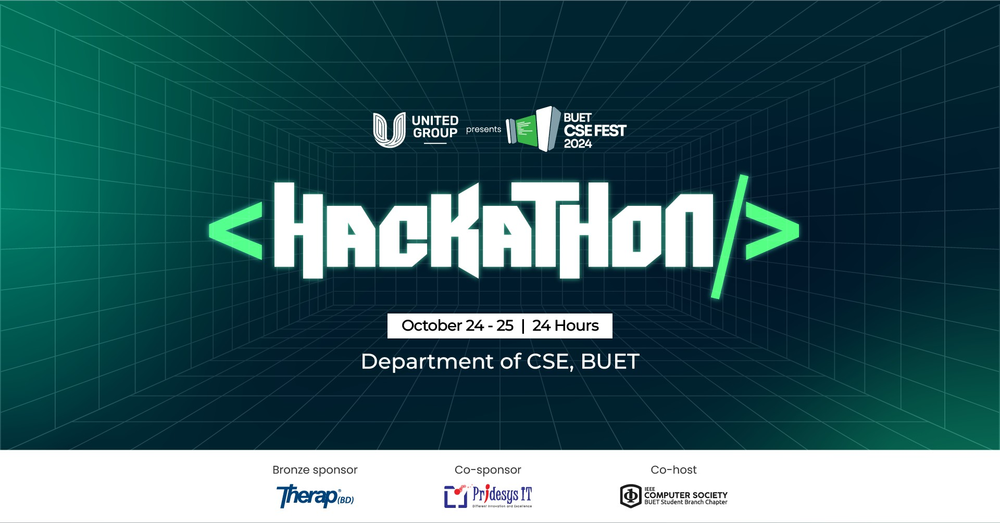
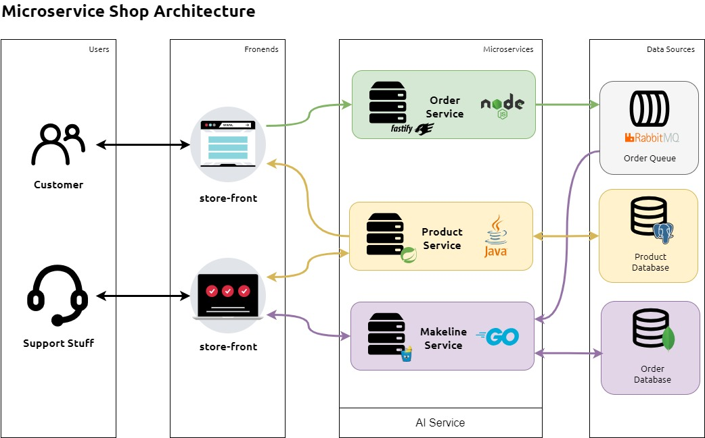

# BUET CSE FEST 2024 Hackathon



## Microservice and DevOps Workshop

This sample demo app consists of a group of containerized microservices that can be easily run locally. This is meant to show a realistic scenario using a polyglot architecture, event-driven design, and common open source back-end services (eg - RabbitMQ, MongoDB, PostgreSQL).

This application is forked from the [AKS Store Demo](https://github.com/Azure-Samples/aks-store-demo/).

> [!NOTE]
> This is not meant to be an example of perfect code to be used in production, but more about showing a realistic microservice architecture to get started with.

## Architecture

The application has the following services: 

| Service | Description |
| --- | --- |
| `makeline-service` | This service handles processing orders from the queue and completing them (Golang) |
| `order-service` | This service is used for placing orders (Javascript) |
| `product-service` | This service is used to perform CRUD operations on products (Java) |
| `store-front` | Web app for customers to place orders (Vue.js) |
| `store-admin` | Web app used by store employees to view orders in queue and manage products (Vue.js) | 
| `virtual-customer` | Simulates order creation on a scheduled basis (Rust) |
| `virtual-worker` | Simulates order completion on a scheduled basis (Rust) |
| `ai-service` | Optional service for adding generative text and graphics creation (Python) |
| `mongodb` | MongoDB instance for persisted data |
| `postgres` | PostgreSQL instance for persisted data of products |
| `rabbitmq` | RabbitMQ for an order queue |



## Run the app locally

The application is designed to be [run in an AKS cluster](#run-the-app-on-aks), but can also be run locally using Docker Compose.

> [!TIP]
> You must have [Docker Desktop](https://www.docker.com/products/docker-desktop) installed to run this app locally. If you do not have it installed locally, you can try opening this repo in a [GitHub Codespace instead](#run-the-app-with-github-codespaces)

To run this app locally:

Clone the repo to your development computer and navigate to the directory:

```console
git clone https://github.com/MJKSabit/bcfh24-workshop.git
cd bcfh24-workshop
docker compose up
```

To run the app, using nginx load balancer, you can run the below command:

```bash
docker compose -f docker-compose-nginx.yml up
```

To stop the app, you can hit the `CTRL+C` key combination in the terminal window where the app is running.

You can access the web apps at the following URLs:

- Store Front: http://localhost:8080
- Store Admin: http://localhost:8081

## Run the app with GitHub Codespaces

This repo also includes [DevContainer configuration](./.devcontainer/devcontainer.json), so you can open the repo using [GitHub Codespaces](https://docs.github.com/en/codespaces/overview). This will allow you to run the app in a container in the cloud, without having to install Docker on your local machine. When the Codespace is created, you can run the app using the same instructions as above.

[](https://github.com/codespaces/new?hide_repo_select=true&ref=main&repo=648726487)

## Run on Kubernetes

This application uses public images stored in GitHub Container Registry and Microsoft Container Registry (MCR). Once your Kubernetes cluster of choice is setup, you can deploy the full app with the manifests at [kubernetes](kubernetes) folder.

```bash
kubectl create ns pets
kubectl apply -f kubernetes/aks-store-all-in-one.yaml -n pets
```

## Additional Resources

- [Docker Tutorial (Code With Mosh)](https://www.youtube.com/watch?v=pTFZFxd4hOI)
- [Docker Compose Tutorial (Code With Mosh)](https://www.youtube.com/watch?v=HG6yIjZapSA)
- [Kubernetes Tutorial (Code World With Nana)](https://www.youtube.com/watch?v=X48VuDVv0do)
